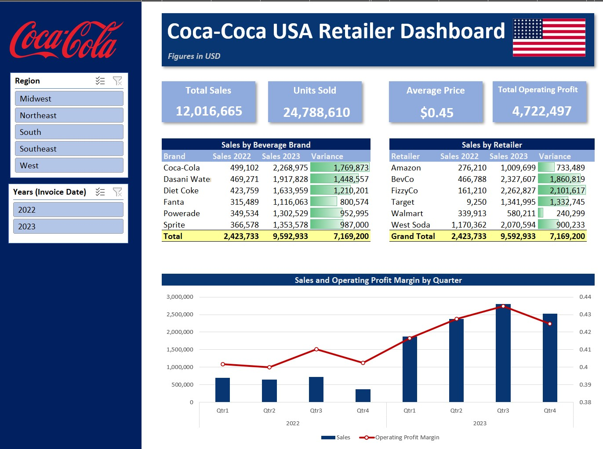
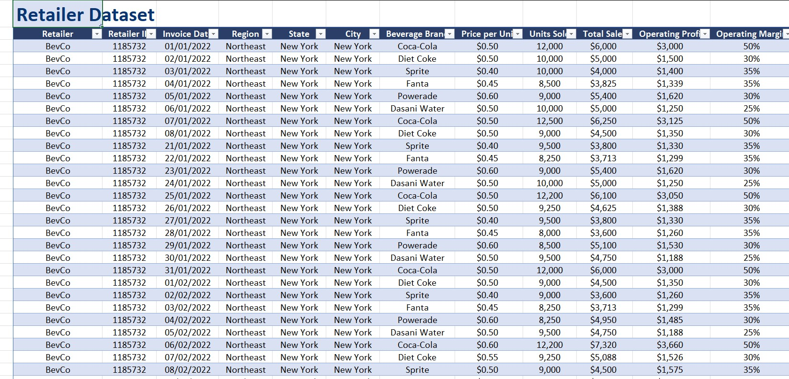
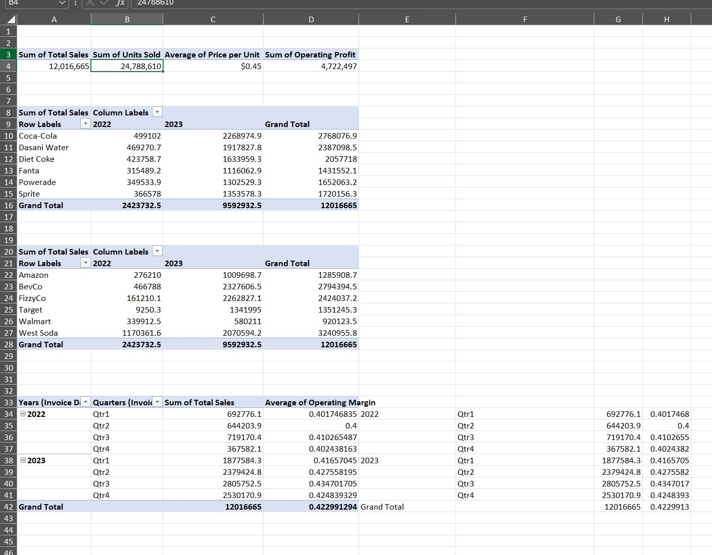

| Excel Interactive Dashboard |  Image |
| --- | --- |
|  |  |

# Creating a Dynamic Dashboard in Excel: A Step-by-Step Guide

First, we'll get the dashboard structure sorted out using Excel shapes and images. After that, it's time to dive into the dataset and crunch some numbers using pivot tables to extract the important bits. Next up, we'll craft the perfect charts and visuals, which will feature essential KPIs (key performance indicators), tables, and charts like a combo chart. And last but not least, we'll add pivot table slicers to give the entire dashboard that dynamic edge.

# The Data Analysis using Pivot tables
| --- | --- |
|  |

# The Final Output

By leveraging pivot tables, incorporating essential KPIs, conducting thorough data analysis, and implementing slicers, i have created a dynamic and comprehensive dashboard that provides actionable insights at a glance.

|  |
